# MEM-ACT-001 — 実装・受入証跡 / Owner Review Pack

施設カードの記録CTAを、施設詳細に実装済みのゲスト記録へ接続しました。
`/try` も同じフォーム・選択タグによる推薦・下書き引き継ぎを使います。
イベントは押す前に無料登録・ログインが必要と表示します。
トップでは記録を主CTAにし、循環説明を検索一覧より前に配置しました。

## 検証条件

- 基準: `183801e8`。指定worktreeで、Productコード変更前のproduction buildを採取。
- 変更後も `npm run build` → `npm run start`。Chromium、未ログイン、390×844、Asia/Tokyo、2026-09-16。
- 認証済みの操作だけはローカル合成Supabaseセッションとloopbackのfixtureを使用。実際のアプリの認証済み分岐・保存フォーム・wishlist追加/解除をブラウザ操作した。Productionアカウント・DBは使用していない。
- 登録URLへ実際に進み、同一タブの下書きが一致することを確認後、合成セッションを設定して実際の保存フォームで復元を確認。外部のメール送信・パスワード認証・OAuth自体は検証範囲外。
- [再実行手順](../../../scripts/activation-qa/README.md)、[全操作の観測値](after/activation.json)、[SEO比較](comparison.json)、[変更前](before/metrics.json) / [変更後DOM計測](after/metrics.json)。

## AC別の確認方法と実測結果

| AC | 確認方法 | 実測結果 |
|---|---|---|
| AC-1 | トップの6つの施設カードで記録CTAを押し、写真なし・ひとこと・反応タグ1つで送信。推薦を施設正本と照合 | 6/6でログインに遷移せず完成。各3件が実在し、選択タグに一致し、記録元施設を除外。全経路合計15回の完成を確認 |
| AC-2 | `/events/tokyo` のボタン文言と押下後URLを両認証状態で観測 | 未ログインでは押下前に「このイベントを記録（無料登録・ログインが必要）」を表示。認証済みは従来の文言と `/mypage/visits/new?event=evt-976-mystery2025-2026` |
| AC-3 | `/try` の施設を選び、file未選択のまま送信。disabledとHTML validityを段階ごとに取得 | file数0、required=false、validity.valid=true、validationMessage空。送信disabledは初期true→ひとことのみtrue→タグ選択後false。完成カードに水遊びタグと推薦3件 |
| AC-4 | `/try` の日付初期値、app内固定値検索、JST境界テスト | 初期値2026-09-16。対象2ファイルを含めapp内の旧固定日付一致0。UTC/Los Angeles/Tokyoの3TZ×日付境界・年越し3ケース=9/9成功 ([証跡](date-check.json)) |
| AC-5 | `/try` のサンプル見出しと注記をDOM・画面で確認 | 「記録のサンプル（架空の入力例）」「ほかの家族の記録ではありません」を表示。旧プレビューの実名入りスタックは公開お試しから撤去 |
| AC-6 | トップ・`/try` の完成画面から登録へ遷移し、sessionStorage全フィールドを比較。登録後保存画面へ復元 | 両入口で引き継ぎ説明あり。登録/ログイン両URLにguestDraft=1。登録画面への遷移後も下書き一致。保存画面に2026-09-16・入力したひとこと・水遊びが復元されることを確認 |
| AC-7 | トップの循環説明内の「登録なしで、記録をはじめる」を実際に押下 | `/try` に直接遷移。循環見出しの画面先頭からの位置は1506.75px（約1.79画面） |
| AC-8 | 390×844で主CTAと検索CTAの矩形・文字サイズ/ウェイトを取得 | 記録CTAはy=388px、358×56px、16px/900。検索の一覧・イベントCTAはy=660px、各173×46px、14px/700。記録CTAは初期画面内 |
| AC-9 | トップのモック見出しと注記をDOMで確認 | 「記録がたまると見える、子どもの『好き』」と「画面イメージ・件数や内容はサンプルです」を表示 |
| AC-10 | `/about` mainの文言・掲載数・必須見出しを確認 | 記録5回、思い出4回、好き3回。47都道府県・5953施設、全県の掲載数、情報の正確性、運営（合同会社F&IC）を保持 |
| AC-11 | 下表のリンク多重集合・既存件数表示・metadata・JSON-LDを基準と自動比較。sitemap loc集合も比較 | 既存リンク・既存件数表示の欠落0。対象のtitle/description/canonical/JSON-LDは一致。sitemap 6088→6088、URL集合完全一致 |
| AC-12 | 下記の全列挙箇所をブラウザ操作。記録、wishlist、写真UIを未ログイン/合成認証済みで確認 | 記録hook 2 consumer、イベントhook 1 consumerを確認。FacilityCardの実consumer 7箇所と、spec指定の写真画面1箇所をすべて確認。ブラウザ例外0 |
| AC-13 | `npm run lint`、`npm run build` とbuild内全validatorを基準・変更後で実行 | 両方exit 0。lint errors 0 / warnings 2→2。validator errors 0 / warnings 19→19。middleware非推奨警告1→1、基準のEdge警告3・webpack cache警告2は変更後ログでは0。6124静的ページ生成。sitemap差分はlastmod更新のみと確認し、robotsとともに復元済み |

施設801の水遊びタグから表示された推薦は「等々力緑地」「海の公園」「県立秦野戸川公園」。
テストでは表示文字だけでなく、各施設の `recommended_for_tags` と選択タグを照合した。

## AC-11 数値比較

| ページ | 内部リンク 基準→変更後 | 件数表示の出現数 基準→変更後 | JSON-LD数 基準→変更後 |
|---|---:|---:|---:|
| `/` | 131→133 | 80→81 | 1→1 |
| `/prefecture/tokyo` | 88→88 | 14→14 | 2→2 |
| `/category/park` | 77→77 | 32→32 | 2→2 |
| `/tag/free` | 66→66 | 6→6 | 2→2 |
| `/prefecture/tokyo/category/park` | 167→167 | 5→5 | 2→2 |
| `/facilities/facility-801` | 42→42 | 0→0 | 2→2 |
| `/events/tokyo` | 45→45 | 3→3 | 2→2 |

件数表示はDOMの「数字+施設/件/都道府県」の出現数。トップの増分は新CTAの「1件」で、元の80表示は数値・出現数とも保持。
主な掲載数は全国5953施設、東京303施設、公園852施設、無料1138施設、東京の公園79施設、東京イベント473件（表示20件）で不変。
内部リンクは同一originのanchorを重複込みで数え、URLごとの本数も非減少を確認。
比較対象は上記の代表ページ。検索・掲載データ・各一覧の描画ロジックは変更していない。

施設詳細のmetadata/構造化データは完全一致。独立したイベント詳細routeは基準にも存在せず、`/events/tokyo` のイベントカードと2つのJSON-LDを比較した。
sitemap-0は5000、sitemap-1は1088、index参照数は2で不変。ビルドによるlastmodの差分はコミットしない。
トップの全高は11844→11960px。情報を削って短くするのではなく、記録開始・循環説明の順番と視覚的階層を変更した。

## AC-12 共有hook・全列挙箇所

`useFacilityIntentActions` は `FacilityActionButtons.tsx` と `FacilityCard.tsx` の2 consumer。
`useEventIntentActions` は `EventRecordButton.tsx` の1 consumer。任意コールだけで終了する分岐は追加していない。

| 確認対象 | 未ログイン実測 | 認証済み実測 |
|---|---|---|
| `components/FacilityActionButtons.tsx` | 施設801でその場のモーダル→完成/推薦3件。wishlistはlogin | facility-801の保存画面へ。wishlist追加→済み→解除 |
| `components/FacilityCard.tsx` → `app/page.tsx` | 6カードすべて対象施設のモーダル→完成/各3件。wishlistはlogin | facility-801の保存画面。wishlist追加/解除 |
| → `app/category/[id]/page.tsx` | `/category/park`、facility-022で完成/3件。wishlistはlogin | facility-022の保存画面。wishlist追加/解除 |
| → `app/tag/[slug]/page.tsx` | `/tag/free`、facility-023で完成/3件。wishlistはlogin | facility-023の保存画面。wishlist追加/解除 |
| → `app/prefecture/[id]/category/[categoryId]/page.tsx` | `/prefecture/tokyo/category/park`、facility-358で完成/3件。wishlistはlogin | facility-358の保存画面。wishlist追加/解除 |
| → `app/facilities/[slug]/page.tsx` | 施設801の関連カードからfacility-837で完成/3件。元施設801と取り違えなし | facility-837の保存画面。wishlist追加/解除 |
| → `components/NearbyFilterableFacilityList.tsx` | `/facilities`、facility-024で完成/3件。wishlistはlogin | facility-024の保存画面。wishlist追加/解除 |
| → `components/PrefectureDiscoveryFacilityList.tsx` | `/prefecture/tokyo`、facility-222で完成/3件。wishlistはlogin | facility-222の保存画面。wishlist追加/解除 |
| spec指定 `app/mypage/visits/from-photo/FromPhotoVisitDraftsClient.tsx` | middlewareがloginへ誘導 | 合成PNG選択→仮日付の下書き→「ソレイユ」検索→施設選択中。保存/アップロードは未実行 |
| `components/EventRecordButton.tsx` | タップ前に要登録明示→eventを保持したlogin URL | eventを保持した保存画面へ |

**仕様の列挙との差**: 写真画面は基準・変更後とも `FacilityCard` のimport/renderがない。
`showSelectedFacilityCard` という独自UIの条件変数があるだけで、実consumerは7箇所。
この差を理由に確認対象から外さず、指定された8番目の画面も上表のとおり操作した。

## Owner Review Pack

すべて390×844。通常の比較画面・ゲストフォームは未ログイン。
「復元」は明示したローカル合成セッションで、入力内容も合成データ。

| 画面 | 変更前 | 変更後 |
|---|---|---|
| トップ初期画面 | 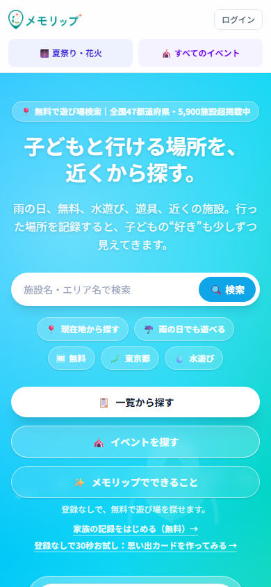 | 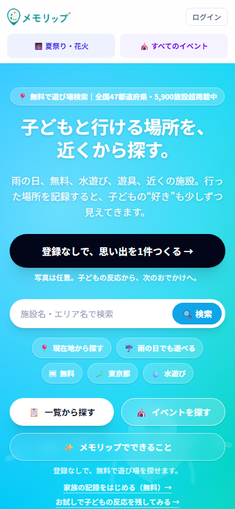 |
| `/try` 入口 | 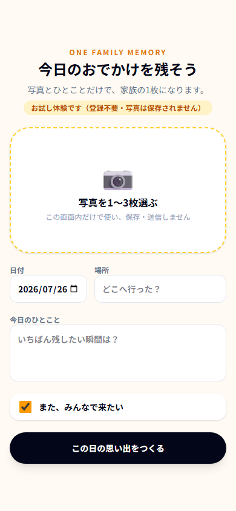 | 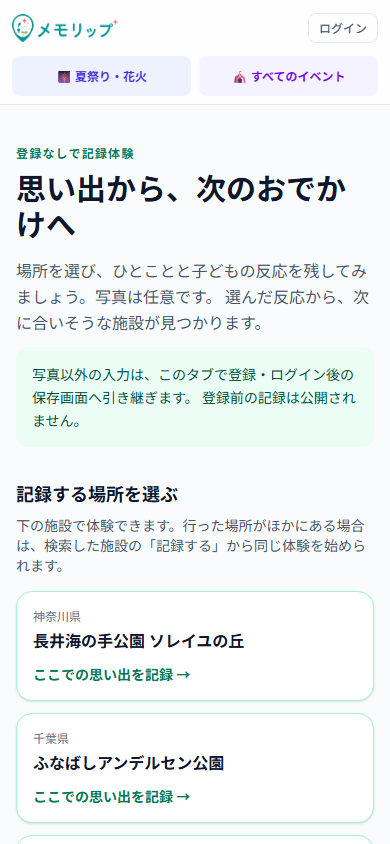 |
| `/about` | 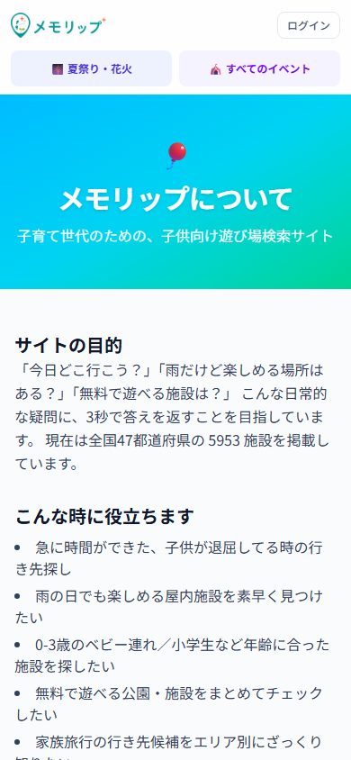 | 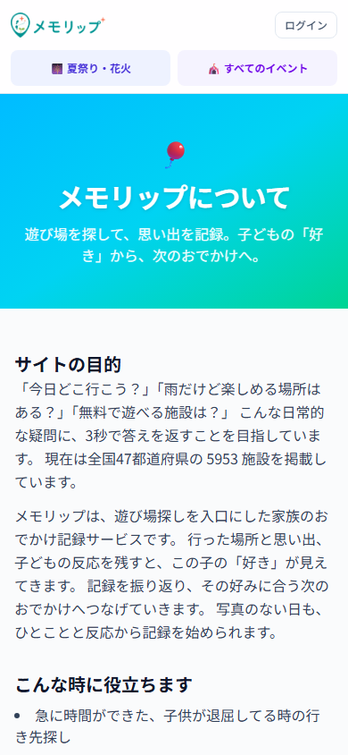 |
| トップの記録CTA押下 | 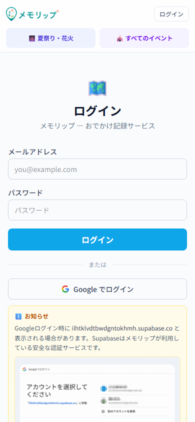 | 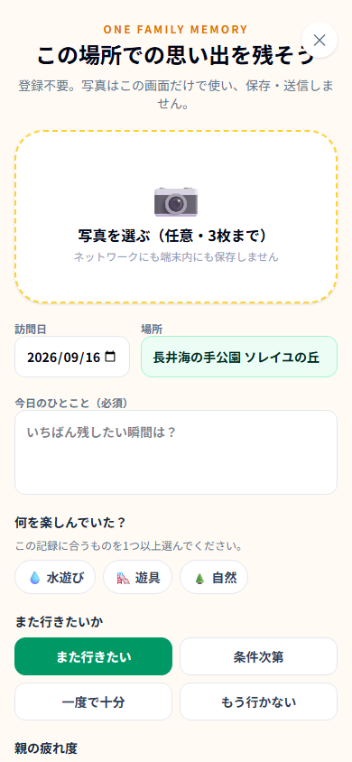 |
| イベントCTA | [変更前の全カード](before/events-tokyo.png) / [押下後](before/event-record-result.png) | 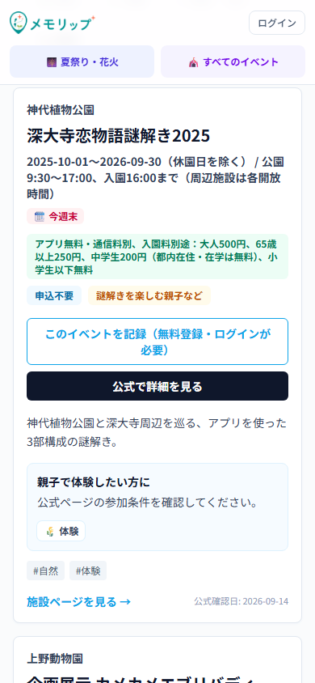 |

全体配置の比較: [トップ変更前](before/home.png) / [トップ変更後](after/home.png)、[about変更前](before/about.png) / [about変更後](after/about.png)、[try変更後全体・サンプル注記](after/try.png)。

| 完走・引き継ぎ | 画面 |
|---|---|
| 写真なし・反応タグ・入力条件 | 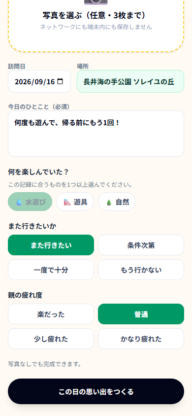 |
| 完成 | 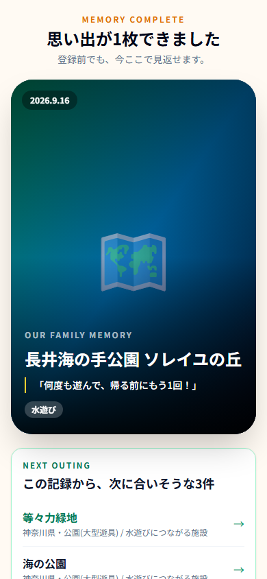 |
| 実データ推薦 | 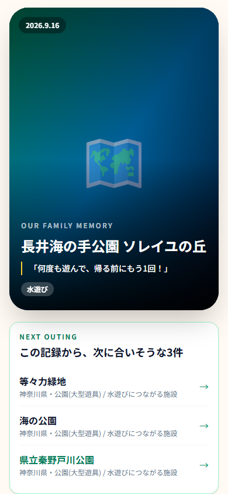 |
| 引き継ぎ説明と登録/ログイン | 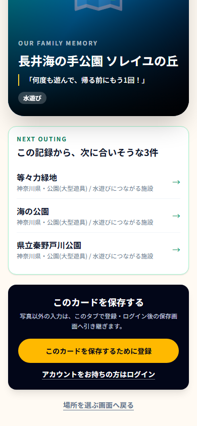 |
| トップからの復元 | 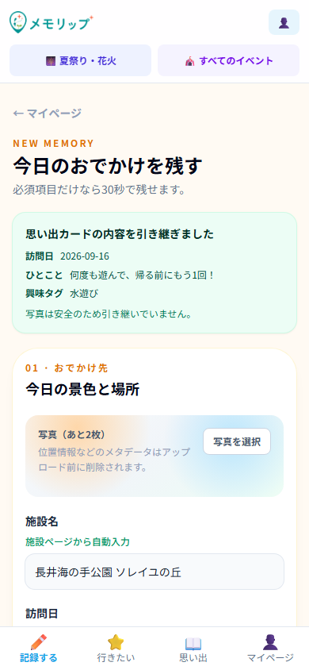 |
| tryからの復元 |  |

## ビルド記録・境界

[基準lint](before/lint.log) / [変更後lint](after/lint.log)、[基準build](before/build.log) / [変更後build](after/build.log)、[ブラウザ操作ログ](after/browser.log)。
ログはworkspaceの絶対パスを匿名化し、末尾空白のみ整形した。検証用のローカル環境変数ファイルとfixture/serverは検証後に撤去・停止した。

推薦エンジン5資産、施設/イベントデータ、schema/migration、package.json/package-lock.json、rotation/dispatch stateは変更なし。
他worktree・private Memoryは操作していない。main merge・Production deploy・action-ledgerはPMの工程として残す。
停止条件（schema変更必要、既存資産で商品約束が成立しない、検索/SEO弱体化が必要）には該当しなかった。
